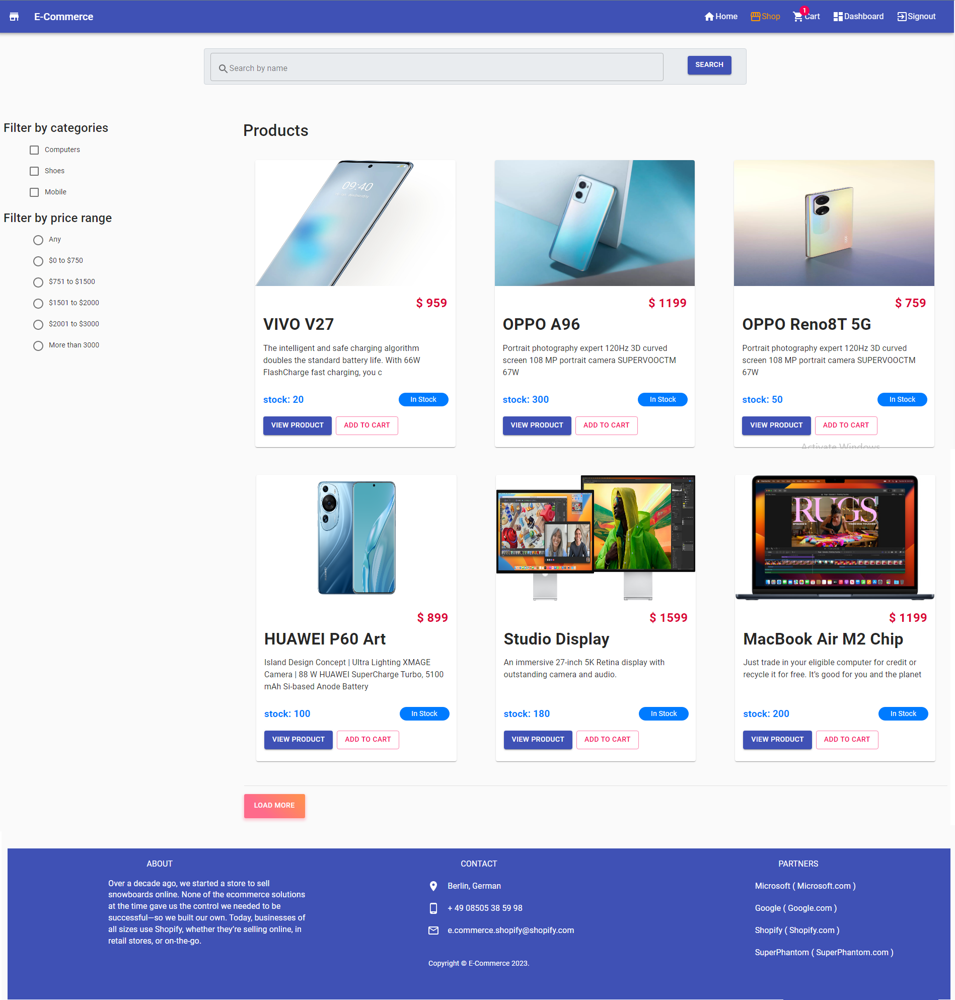
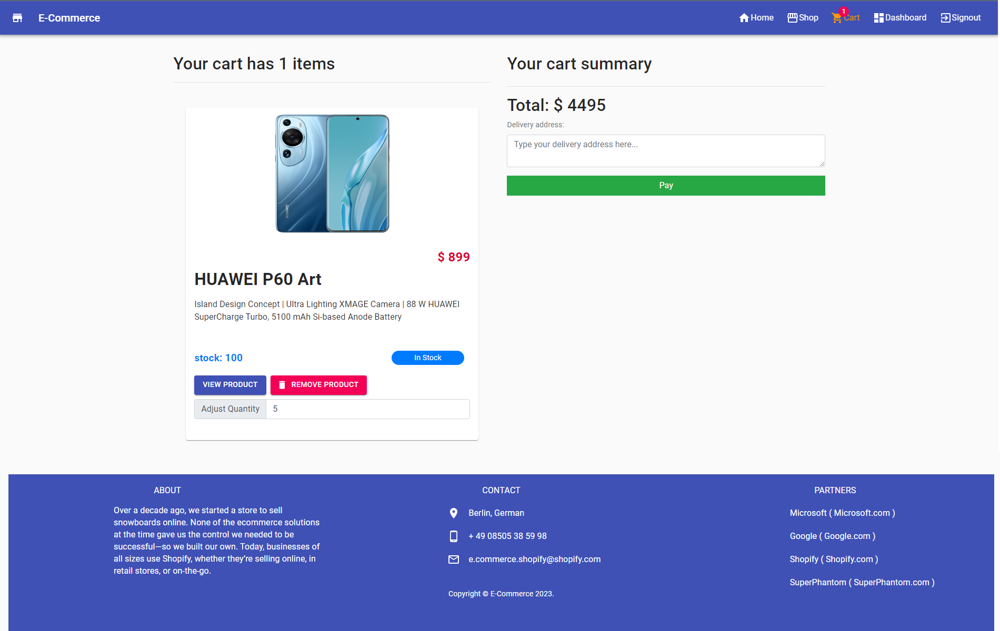
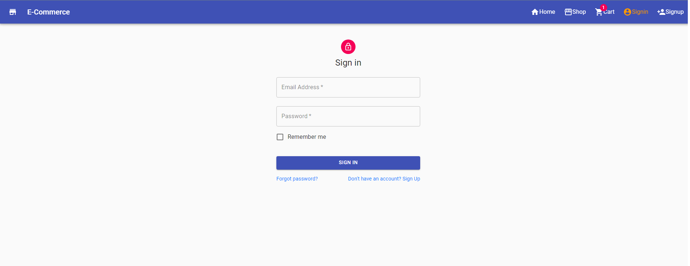
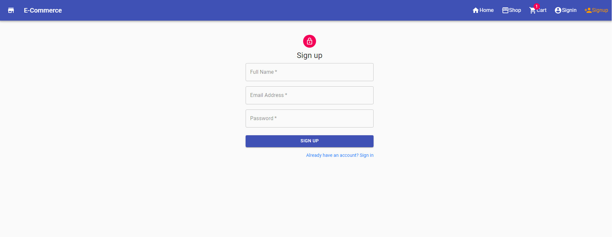

# E-Commerce

E-commerce is an ever developing area. With the advancement in technology and communication, e-commerce has also gained popularity among the people of India and worldwide. It has made e-business easy and accessible to people sitting at home. E-commerce has a huge impact on costs, access to goods and services and increased productivity of businesses. It also plays an important role in the economic growth and development of a nation. Though it is a relatively new area belonging to the era of the internet, it has the potential to change and replace the traditional form of business and trade activities. 
### App Description:
    1. user can view all products
    2. user can view single product
    3. user can search products and view products by category and price range
    4. user can add to cart checkout products using credit card info
    5. user can register & sign in
    6. admin can create, edit, update & delete products
    7. admin can create, edit, update & delete categories
    8. admin can view ordered products


### Technologies Used

> Frontend-> React JS

> Backend-> Node JS & Express JS

> Database-> MongoDB Atlas

### Demo photos
  Home
  
  
<details>
  Shop
  
  
  Detail
  
    
  Cart
    
    
  SignIn
  
  
  SignOn
      
</details>
    
## Installation & deployment(local server) process

    ```
1. #### install npm packages
    1. install backend packages
    ```bash
    cd Shopify
    npm install
    ```
    2. install frontend packages
    ```bash
    cd client
    npm install
    ```
2. go to the parent folder of Shopify & create .env for mongodb connection, JWT_SECRET, BRAINTREE_MERCHANT_ID, BRAINTREE_PUBLIC_KEY and BRAINTREE_PRIVATE_KEY.

    ##### sample code for backend .env
    ```env
    MONGO_URI=YOUR_MONGO_URI
    JWT_SECRET=YOUR_JWT_SECRET
    BRAINTREE_MERCHANT_ID=YOUR_BRAINTREE_MERCHANT_ID
    BRAINTREE_PUBLIC_KEY=YOUR_BRAINTREE_PUBLIC_KEY
    BRAINTREE_PRIVATE_KEY=YOUR_BRAINTREE_PRIVATE_KEY
    ```
3.  create another .env file inside client directory for REACT_APP_API_URL.
    
    ##### sample code for frontend .env
    ```env
    REACT_APP_API_URL=YOUR_API_URL
    ```
    ##### Instruction:
    1. for mongodb atlas database creation follow this tutorial->https://www.youtube.com/watch?v=KKyag6t98g8
    2. you can use any random string as JWTSECRET
    3. for localhost REACT_APP_API_URL is http://localhost:5000/api
       but for heroku (server deployment) it will be different
    4. #### note: add .env on .gitignore
    5. for server deployment use secrets directly

4. <b>deploy this project</b> on your local server by using this command
    ```bash
    cd Shopify
    npm run server
    ```
    <b>In another terminal/power shell</b>
    ```bash
    cd Shopify\client
    npm start
    ```
    #### note: both backend & frontend server will start with the above commands.

5. #### Database Structure: (Table: columns)
    1. categories: _id, name, createdAt, updatedAt;
    2. orders:  _id, status, products (Array), transaction_id, amount, address, user (Object), createdAt, updatedAt
    3. products: _id, photo (Object), sold, name, description, price, category, shipping, quantity, createdAt, updatedAt
    4. users: _id, role, history (Array), name, email, salt, hashed_password, createdAt, updatedAt

## Authors
  
    SuperPhantom
